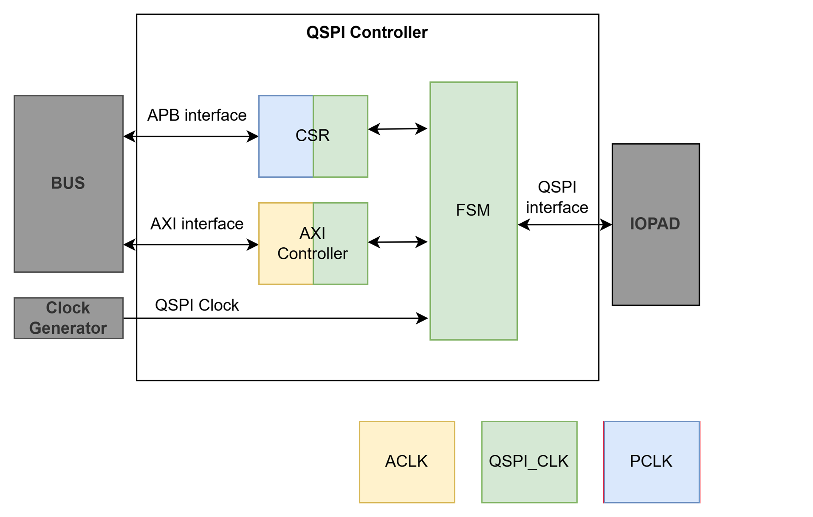

# QSPI/SPI PSRAM Controller

A SystemVerilog IP that bridges an **AXI4** memory-mapped host bus to an external **PSRAM** device over a **QSPI (Quad SPI) / SPI** interface, with an **APB**-based CSR block for run-time configuration. Developed by **VLSI Technology**.



## Features

- AXI4 full slave interface (AW/W/B/AR/R) with `FIXED`, `INCR`, and `WRAP` burst support
- APB slave interface for CSR configuration, safely crossed into the core clock domain
- QSPI (4-bit) and SPI (1-bit) PSRAM protocol support, switchable at run time
- Dynamically reconfigurable read/write commands, address/data widths, and dummy-cycle counts
- Software-issued independent (command-only) transactions, e.g. for SPI ⇄ QSPI mode switches
- XIP-style streaming access inferred automatically from AXI burst length
- Round-robin arbitration between concurrent read and write requests
- Three independent, fully asynchronous clock domains (AXI / APB / QSPI), crossed via toggle-vector async FIFOs and a 4-phase CSR handshake

## Repository Layout

```
AXI-PSRAM-Controller/
├── rtl/                        RTL sources
│   ├── m_vlsi_qspi_top.sv      Top-level integration (AXI + CSR + QSPI FSM)
│   ├── m_vlsi_qspi_fsm.sv      QSPI/SPI transaction FSM (CMD-ADDR-DUMMY-DATA)
│   ├── m_vlsi_synch.sv         2-stage flip-flop synchronizer (1-bit)
│   ├── m_vlsi_multi_synch.sv   2-stage flip-flop synchronizer (vector)
│   ├── m_vlsi_async_fifo.sv    Toggle-vector async FIFO (ACLK <-> SCLK)
│   ├── filelist.f              Full RTL file list for m_vlsi_qspi_top
│   ├── AXI_CONTROLLER/         AXI4 slave, arbiter, bus/sclk logic
│   └── CSR/                    APB CSR block + CSR generator tool (own README)
├── doc/                        Hardware design specification, register map, diagrams
├── sim/vcs/                    VCS/Icarus/Verilator testbench (AXI + APB + QSPI BFMs)
├── lint/                       Static lint setups (Verilator and a static-lint shell flow)
├── cdc/                        Clock-domain-crossing checks (static CDC shell flow)
├── source_me.sh                Environment setup (QSPI_HOME, QSPI_RTL, QSPI_FILELIST)
├── gen_spec.py / gen_docx.py   Generate doc/Spec.docx from the block diagrams and tables
└── README.md                   This file
```

## Architecture

| Sub-system | Module(s) | Clock domain | Role |
|---|---|---|---|
| AXI Controller | `m_vlsi_axfsm` ×2, `m_vlsi_axi_bus_logic`, `m_vlsi_axi_sclk_logic`, `m_vlsi_arbiter`, `m_vlsi_async_fifo` ×5 | ACLK / SCLK | Accepts AXI transactions, crosses to SCLK, drives PSRAM interface |
| CSR | `m_vlsi_qspi_csr` | PCLK / SCLK | APB register file with 4-phase handshake CDC |
| QSPI FSM | `m_vlsi_qspi_fsm` | SCLK | Transaction engine: CMD → ADDR → DUMMY → DATA sequencing |
| Synchronizer | `m_vlsi_synch`, `m_vlsi_multi_synch` | Various | 2-stage flip-flop synchronizers used by FIFO CDC and CSR CDC |
| Arbiter | `m_vlsi_arbiter` | SCLK | Round-robin read/write arbitration |

Top-level parameters (`m_vlsi_qspi_top`):

| Parameter | Default | Description |
|---|---|---|
| `PARA_AXI_DATA_WD` | 32 | AXI data bus width (bits) |
| `PARA_AXI_ADDR_WD` | 24 | AXI address bus width (bits) |
| `PARA_AXI_ID_WD` | 4 | AXI ID field width (bits) |
| `PARA_AXI_LEN_WD` | 8 | AXI burst length field width (bits) |
| `PARA_AXI_FIFO_DEPTH` | 8 | Depth of each async FIFO |

See **[doc/Readme.md](doc/Readme.md)** for the full hardware design specification: port list, clock/reset details, CDC schemes, the complete CSR register map, FSM state descriptions, and a software integration guide. The formal spec is also available as a PDF ([QSPI_PSRAM_Controller_Specification2.1.pdf](doc/QSPI_PSRAM_Controller_Specification2.1.pdf)) and as an editable draw.io diagram ([QSPI.drawio](doc/QSPI.drawio)); the CSR field layout is tracked in [CSR_QSPI.xlsx](doc/CSR_QSPI.xlsx).

## Getting Started

```bash
git clone https://github.com/nguyenquanicd/AXI-PSRAM-Controller.git
cd AXI-PSRAM-Controller
source source_me.sh
```

`source_me.sh` exports `QSPI_HOME`, `QSPI_RTL`, and `QSPI_FILELIST` (pointing at [rtl/filelist.f](rtl/filelist.f)), which the RTL file list and downstream tool scripts rely on.

### Lint

```bash
./lint/verilator/run_lint.sh
```

Runs `verilator --lint-only` against `m_vlsi_qspi_top` using [filelist.f](rtl/filelist.f). An additional static-lint shell flow is also available under [lint/vc_static](lint/vc_static).

### Simulation

The testbench in [sim/vcs](sim/vcs) instantiates AXI/APB bus-functional models plus a PSRAM behavioral model ([sim/vcs/env](sim/vcs/env)) and drives the `basic_qspi_psram_test` sequence. The Makefile auto-selects between VCS, Icarus Verilog, and Verilator:

```bash
cd sim/vcs

# Icarus Verilog (free/open source)
make SIM=iverilog build run
make SIM=iverilog waves     # opens GTKWave

# VCS
make SIM=vcs build run
make SIM=vcs waves          # opens Verdi
```

### CDC Checks

Clock-domain-crossing verification lives in [cdc/vc_static](cdc/vc_static/run_cdc.sh), checking the ACLK ↔ SCLK async FIFOs and the PCLK ↔ SCLK CSR handshake described in the spec.

## CSR Register Map (summary)

All registers are 32-bit and accessed over APB, synchronized into the SCLK domain via a 4-phase handshake. Full bit-field descriptions are in [doc/Readme.md § VI](doc/Readme.md#vi-configuration-registers-csr).

| Offset | Register | Purpose |
|---|---|---|
| `0x00` | `ctrl` | IP enable, command byte width, auto data-width mode |
| `0x04` | `wd` | Address/data width reconfiguration (req/ack) |
| `0x08` | `read` | Read command opcode (req/ack) |
| `0x0C` | `write` | Write command opcode (req/ack) |
| `0x10` | `wr_dummy` | Write dummy-cycle count |
| `0x14` | `rd_dummy` | Read dummy-cycle count |
| `0x18` | `mode_status` | Current interface mode (SPI/QSPI), read-only |
| `0x1C` | `independent` | Command-only transaction (e.g. SPI ⇄ QSPI switch) |

## Sub-project: CSR Generator

[rtl/CSR](rtl/CSR/README.md) doubles as a standalone APB CSR generation tool: it produces a CSR module (RW/RO/RWI/W1C fields, optional asynchronous bus/register clocks) from an Excel workbook definition ([CSR.xlsx](rtl/CSR/CSR.xlsx)). See [rtl/CSR/README.md](rtl/CSR/README.md) and [rtl/CSR/test_env/README.md](rtl/CSR/test_env/README.md) for its own lint/sim flow.

## References

| Component | Repository |
|---|---|
| AXI Controller Function | <https://github.com/nguyenquanicd/AXI4-SRAM-CONTROLLER> |
| CSR Interface (APB CSR Generator) | <https://github.com/nguyenquanicd/APB-CSR-Generator> |
| PSRAM Model (used for verification) | <https://github.com/chipfoundry/EF_PSRAM_CTRL-1> |

## Contact

This IP is developed and maintained by **VLSI Technology**.
