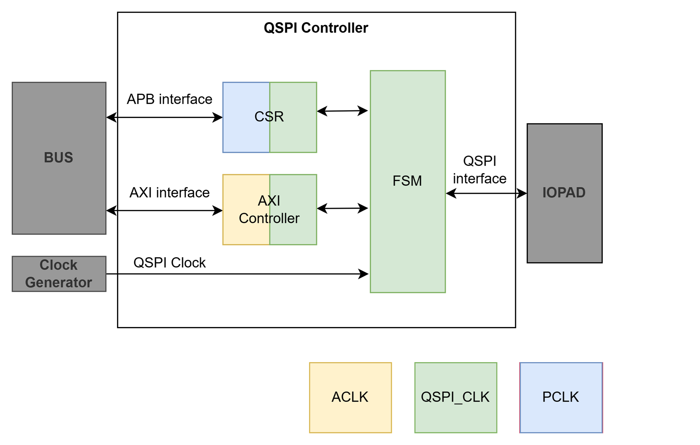
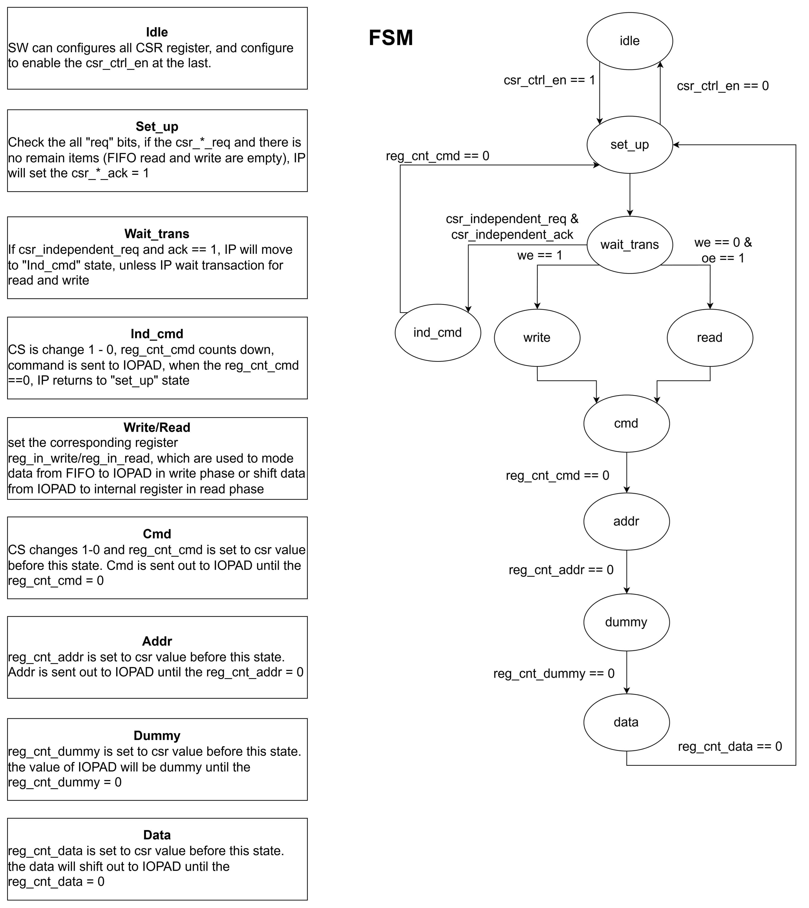

# QSPI/SPI PSRAM Controller — Hardware Design Specification

**Revision:** 2.0
**Date:** 2026-06
**Author:** Ethan, Link
**Page:** VLSI Technology

---

## I. Overview

The QSPI PSRAM Controller is a hardware IP developed by **VLSI Technology** that bridges an AXI4 memory-mapped bus to an external PSRAM device over a QSPI (Quad SPI) or standard SPI interface. The IP accepts AXI4 read and write transactions from a host, translates them into the command–address–dummy–data phase sequence required by QSPI/SPI PSRAMs, and drives the I/O pads accordingly. A separate APB slave interface provides run-time configuration of command values, data widths, dummy-cycle counts, and operating mode through a set of Control and Status Registers (CSRs).

**Key capabilities:**

- AXI4 full slave interface (AW, W, B, AR, R channels) with burst support (FIXED, INCR, WRAP)
- APB slave interface for CSR configuration
- QSPI (4-bit I/O) and SPI (1-bit I/O) protocol support
- Software-controlled independent commands (e.g., mode switching)
- Dynamic reconfiguration of read/write commands, address/data widths, and dummy cycles
- XIP (Execute-In-Place) support inferred from AXI burst semantics
- Round-robin arbitration between concurrent read and write requests

**Top-level parameters:**

| Parameter | Default | Description |
|---|---|---|
| `PARA_AXI_DATA_WD` | 32 | AXI data bus width (bits) |
| `PARA_AXI_ADDR_WD` | 24 | AXI address bus width (bits) |
| `PARA_AXI_ID_WD` | 4 | AXI ID field width (bits) |
| `PARA_AXI_LEN_WD` | 8 | AXI burst length field width (bits) |
| `PARA_AXI_FIFO_DEPTH` | 8 | Depth of each async FIFO |

---

## II. Block Diagram



The controller comprises five major sub-systems:

| Sub-system | Module(s) | Clock domain | Role |
|---|---|---|---|
| AXI Controller | `m_vlsi_axfsm` ×2, `m_vlsi_axi_bus_logic`, `m_vlsi_axi_sclk_logic`, `m_vlsi_arbiter`, `m_vlsi_async_fifo` ×5 | ACLK / SCLK | Accepts AXI transactions, crosses to SCLK, drives PSRAM interface |
| CSR | `m_vlsi_qspi_csr` | PCLK / SCLK | APB register file with 4-phase handshake CDC |
| QSPI FSM | `m_vlsi_qspi_fsm` | SCLK | Transaction engine: CMD–ADDR–DUMMY–DATA sequencing |
| Synchroniser | `m_vlsi_synch`, `m_vlsi_multi_synch` | Various | 2-stage flip-flop synchronisers used by FIFO CDC and CSR CDC |
| Arbiter | `m_vlsi_arbiter` | SCLK | Round-robin read/write arbitration |

---

## III. Port Description

### 3.1 Clock and Reset

| Port | Direction | Width | Description |
|---|---|---|---|
| `i_axi_clk` | Input | 1 | AXI bus clock (ACLK) |
| `i_axi_rstn` | Input | 1 | AXI active-low synchronous reset |
| `i_apb_clk` | Input | 1 | APB bus clock (PCLK) |
| `i_apb_rstn` | Input | 1 | APB active-low synchronous reset |
| `i_qspi_clk` | Input | 1 | QSPI/internal logic clock (SCLK). Also directly drives `o_qspi_sclk`. |
| `i_qspi_rstn` | Input | 1 | QSPI active-low synchronous reset |

### 3.2 AXI4 Slave Interface

#### Write Address Channel (AW)

| Port | Direction | Width | Description |
|---|---|---|---|
| `i_awvalid` | Input | 1 | Write address valid |
| `o_awready` | Output | 1 | Write address ready |
| `i_awaddr` | Input | `PARA_AXI_ADDR_WD` | Write address |
| `i_awid` | Input | `PARA_AXI_ID_WD` | Write transaction ID |
| `i_awlen` | Input | `PARA_AXI_LEN_WD` | Burst length minus 1 |
| `i_awsize` | Input | 3 | Burst size |
| `i_awburst` | Input | 2 | Burst type: `00`=FIXED, `01`=INCR, `10`=WRAP |

#### Write Data Channel (W)

| Port | Direction | Width | Description |
|---|---|---|---|
| `i_wvalid` | Input | 1 | Write data valid |
| `o_wready` | Output | 1 | Write data ready |
| `i_wdata` | Input | `PARA_AXI_DATA_WD` | Write data |
| `i_wstrb` | Input | `PARA_AXI_DATA_WD/8` | Write strobes |
| `i_wlast` | Input | 1 | Last beat of burst |

#### Write Response Channel (B)

| Port | Direction | Width | Description |
|---|---|---|---|
| `o_bvalid` | Output | 1 | Write response valid |
| `i_bready` | Input | 1 | Write response ready |
| `o_bid` | Output | `PARA_AXI_ID_WD` | Write response ID |
| `o_bresp` | Output | 2 | Write response: `00`=OKAY, `10`=SLVERR |

#### Read Address Channel (AR)

| Port | Direction | Width | Description |
|---|---|---|---|
| `i_arvalid` | Input | 1 | Read address valid |
| `o_arready` | Output | 1 | Read address ready |
| `i_araddr` | Input | `PARA_AXI_ADDR_WD` | Read address |
| `i_arid` | Input | `PARA_AXI_ID_WD` | Read transaction ID |
| `i_arlen` | Input | `PARA_AXI_LEN_WD` | Burst length minus 1 |
| `i_arsize` | Input | 3 | Burst size |
| `i_arburst` | Input | 2 | Burst type: `00`=FIXED, `01`=INCR, `10`=WRAP |

#### Read Data Channel (R)

| Port | Direction | Width | Description |
|---|---|---|---|
| `o_rvalid` | Output | 1 | Read data valid |
| `i_rready` | Input | 1 | Read data ready |
| `o_rdata` | Output | `PARA_AXI_DATA_WD` | Read data |
| `o_rid` | Output | `PARA_AXI_ID_WD` | Read response ID |
| `o_rlast` | Output | 1 | Last beat of burst |
| `o_rresp` | Output | 2 | Read response: `00`=OKAY |

### 3.3 APB Slave Interface

| Port | Direction | Width | Description |
|---|---|---|---|
| `i_psel` | Input | 1 | APB select |
| `i_penable` | Input | 1 | APB enable |
| `i_pwrite` | Input | 1 | APB write (`1`) / read (`0`) |
| `i_paddr` | Input | 16 | APB address |
| `i_pwdata` | Input | 32 | APB write data |
| `i_pstrb` | Input | 4 | APB write strobes |
| `i_pprot` | Input | 3 | APB protection attributes |
| `i_protect_en` | Input | 1 | Enable protection check on `pprot[1]` |
| `i_slverr_en` | Input | 1 | Enable SLVERR on address/strobe violations |
| `o_prdata` | Output | 32 | APB read data |
| `o_pready` | Output | 1 | APB ready (stalls bus while CDC in progress) |
| `o_pslverr` | Output | 1 | APB slave error |

### 3.4 QSPI Pad Interface

| Port | Direction | Width | Description |
|---|---|---|---|
| `o_qspi_sclk` | Output | 1 | QSPI clock output — directly wired from `i_qspi_clk` |
| `o_qspi_csn` | Output | 1 | QSPI chip-select (active low) |
| `io_qspi_data` | Inout | 4 | Quad SPI data lines: DQ[3:0] |

> **Note:** `o_qspi_sclk` is a direct wire assignment (`assign o_qspi_sclk = i_qspi_clk`). There is no clock gating on the SCLK output.

---

## IV. Clocks and Resets

The IP operates across **three independent, asynchronous clock domains**:

| Clock | Reset | Domain name | Used by |
|---|---|---|---|
| `i_axi_clk` | `i_axi_rstn` | ACLK | AXI4 bus logic, async FIFO write side (AW, W, AR) and read side (B, R) |
| `i_apb_clk` | `i_apb_rstn` | PCLK | APB CSR interface, 4-phase handshake bus side |
| `i_qspi_clk` | `i_qspi_rstn` | SCLK | QSPI FSM, register file, async FIFO SCLK side, 4-phase handshake reg side |

All resets are active-low. Each domain has its own independent reset and must be held in reset until its clock is stable.

`o_qspi_sclk` is tied directly to `i_qspi_clk` with no gating; the clock runs continuously whenever the IP is powered.

---

## V. Clock Domain Crossing (CDC)

### 5.1 ACLK ↔ SCLK: Asynchronous FIFO (Toggle-Vector Scheme)

The AXI Controller uses five asynchronous FIFOs (`m_vlsi_async_fifo`) to cross between ACLK and SCLK:

| FIFO | Direction | Contents |
|---|---|---|
| AWFIFO | ACLK → SCLK | Write address: `{aw_last, aw_id, aw_addr}` |
| WFIFO | ACLK → SCLK | Write data: `{w_last, w_data}` |
| ARFIFO | ACLK → SCLK | Read address: `{ar_last, ar_id, ar_addr}` |
| BFIFO | SCLK → ACLK | Write response: `{aw_id, bresp}` |
| RFIFO | SCLK → ACLK | Read response: `{rd_id, 2'b00, rdata, rd_last}` |

**CDC scheme — Toggle-Vector (not Gray-encoded pointers):**

Each FIFO uses a PARA_DEPTH-wide shift register (`reg_wval` on the write side, `reg_rval` on the read side) to track occupancy. On each write, the write-side vector shifts left and inverts the MSB. The same operation occurs on each read on the read side. Occupancy is determined by XOR/XNOR comparison between the local vector and the synchronized copy of the opposite side's vector.

```
Write side:
  reg_wval <= {reg_wval[DEPTH-2:0], ~reg_wval[DEPTH-1]};   // shift + invert MSB on every write
  wr_comb_val = reg_wval ~^ rval_sync;                       // XNOR with synced read vector
  o_write_valid = wr_comb_val[reg_wr_cnt];                   // slot available when bits match

Read side:
  reg_rval <= {reg_rval[DEPTH-2:0], ~reg_rval[DEPTH-1]};    // shift + invert MSB on every read
  rd_comb_val = reg_rval ^ wval_sync;                        // XOR with synced write vector
  o_read_valid = rd_comb_val[reg_rd_cnt];                    // data available when bits differ
```

Each direction uses a `m_vlsi_multi_synch` instance (PARA_DEPTH-wide 2-stage synchronizer) to safely transfer the vector to the opposite clock domain.

**Timing constraints required:**

```
set_max_delay -from [get_clocks ACLK] -to [get_clocks SCLK] <1.5 × SCLK_period>
set_max_delay -from [get_clocks SCLK] -to [get_clocks ACLK] <1.5 × ACLK_period>
```

### 5.2 PCLK ↔ SCLK: 4-Phase Handshake (CSR)

The CSR module crosses APB register accesses into the SCLK domain using a 4-phase handshake. The mechanism is identical for reads and writes:

```
PCLK domain                        SCLK domain
-----------                        ------------
APB access detected
  → reg_req asserted ──────────── synch ──→ req_reg_clk rising edge
                                             → register access occurs
                                             → reg_ack = req delayed 1 cycle
  ack_bus_clk (synced) ←──────── synch ──── reg_ack
  falling edge of ack_bus_clk
  → PREADY asserted 1 cycle later
  → reg_req cleared on next ack high
```

Key signals in `m_vlsi_qspi_csr`:

- `reg_read_req` / `reg_write_req`: request flops in PCLK domain
- `read_req_reg_clk` / `write_req_reg_clk`: synchronized request in SCLK domain (rising edge = trigger)
- `read_ack` / `write_ack`: delayed copy of synchronized request, used as ACK back to PCLK domain
- `read_ack_bus_clk` / `write_ack_bus_clk`: ACK synchronized back to PCLK
- `PREADY` is asserted one PCLK cycle after the falling edge of the synchronized ACK

The APB bus is stalled (`PREADY` deasserted) for the full round-trip CDC latency (approximately 2 × SCLK + 2 × PCLK cycles minimum).

**Timing constraints required:**

```
set_max_delay -from [get_clocks PCLK] -to [get_clocks SCLK] <1.5 × SCLK_period>
set_max_delay -from [get_clocks SCLK] -to [get_clocks PCLK] <1.5 × PCLK_period>
```

---

## VI. Configuration Registers (CSR)

All registers are 32 bits wide and accessed through the APB interface. The register file is clocked by SCLK; APB writes and reads are synchronized via the 4-phase handshake described in Section V.2.

**Access type key:** RW = read/write, RO = read-only, RWI = read/write with hardware write-back (hardware can clear the `req` bit)

### 0x00 — `ctrl` (Control)

| Bits | Field | Access | Reset | Description |
|---|---|---|---|---|
| [31:3] | — | — | 0 | Reserved |
| [2] | `cmd_2bytes` | RW | 0 | `0`: 1-byte (8-bit) command; `1`: 2-byte (16-bit) command |
| [1] | `auto_data_wd` | RW | 0 | `1`: automatically set data width to `PARA_DATA_WD-1` on each transaction |
| [0] | `en` | RW | 0 | IP enable. Must be set before issuing AXI transactions. |

### 0x04 — `wd` (Width Configuration)

| Bits | Field | Access | Reset | Description |
|---|---|---|---|---|
| [31] | `req` | RWI | 0 | Write `1` to request a width change. Hardware clears after ACK. |
| [30] | `ack` | RO | 0 | Hardware asserts when the width change has been applied in SCLK domain. |
| [29:24] | `addr` | RW | 0 | Address width (6-bit value, unit: bits) |
| [23:0] | `data` | RW | 0 | Data width (24-bit value, unit: bits) |

### 0x08 — `read` (Read Command)

| Bits | Field | Access | Reset | Description |
|---|---|---|---|---|
| [31] | `req` | RWI | 0 | Write `1` to update the read command. Hardware clears after ACK. |
| [30] | `ack` | RO | 0 | Hardware asserts when the new command is latched in SCLK domain. |
| [29:16] | — | — | 0 | Reserved |
| [15:0] | `cmd` | RW | 0 | Read command value (8-bit or 16-bit, selected by `ctrl.cmd_2bytes`) |

### 0x0C — `write` (Write Command)

| Bits | Field | Access | Reset | Description |
|---|---|---|---|---|
| [31] | `req` | RWI | 0 | Write `1` to update the write command. Hardware clears after ACK. |
| [30] | `ack` | RO | 0 | Hardware asserts when the new command is latched in SCLK domain. |
| [29:16] | — | — | 0 | Reserved |
| [15:0] | `cmd` | RW | 0 | Write command value (8-bit or 16-bit, selected by `ctrl.cmd_2bytes`) |

### 0x10 — `wr_dummy` (Write Dummy Count)

| Bits | Field | Access | Reset | Description |
|---|---|---|---|---|
| [31:0] | `num` | RW | 0 | Number of dummy cycles for write transactions. Full 32-bit field is stored; the FSM currently consumes only bits [3:0]. |

> **Note:** In QSPI mode the FSM uses `num[3:0] >> 2`; in SPI mode it uses `num[3:0]` directly. The 32-bit register width is reserved for future support of extended dummy cycle configurations.

### 0x14 — `rd_dummy` (Read Dummy Count)

| Bits | Field | Access | Reset | Description |
|---|---|---|---|---|
| [31:0] | `num` | RW | 0 | Number of dummy cycles for read transactions. Full 32-bit field is stored; the FSM currently consumes only bits [3:0]. |

> **Note:** Same scaling as `wr_dummy` — QSPI: `num[3:0] >> 2`; SPI: `num[3:0]`.

### 0x18 — `mode_status` (Mode Status)

| Bits | Field | Access | Reset | Description |
|---|---|---|---|---|
| [31:2] | — | — | 0 | Reserved |
| [1:0] | `current` | RO | 0 | Current interface mode: `00`=SPI, `01`=reserved, `10`=QSPI, `11`=reserved. Reflects `i_csr_independent_mode` combinationally from the FSM. |

### 0x1C — `independent` (Independent Command)

| Bits | Field | Access | Reset | Description |
|---|---|---|---|---|
| [31] | `req` | RWI | 0 | Write `1` to issue an independent command. Hardware clears after ACK. |
| [30] | `ack` | RO | 0 | Hardware asserts when the FSM has accepted the independent command. |
| [29:28] | `mode` | RW | 0 | Target interface mode after this command: `00`=SPI, `10`=QSPI |
| [27:16] | — | — | 0 | Reserved |
| [15:0] | `cmd` | RW | 0 | Command value to send (independent of read/write command registers) |

---

## VII. Functional Description

### 7.1 QSPI FSM States

The QSPI FSM (`m_vlsi_qspi_fsm`) implements the core transaction sequencing in the SCLK domain.



| State | Description |
|---|---|
| `S_IDLE` | Waiting for a request from the arbiter |
| `S_SET_UP` | Captures CSR configuration (command, width, dummy count) and acknowledges pending CSR requests |
| `S_WAIT_TRANS` | Asserts `o_ax_write_valid` to accept write data from the AXI SCLK logic |
| `S_IND_CMD` | Sends an independent (command-only) transaction to the PSRAM |
| `S_CMD` | Drives the command phase on QSPI pads |
| `S_ADDR` | Drives the address phase on QSPI pads |
| `S_DUMMY` | Drives the dummy phase (tri-state); cycle count scaled per mode |
| `S_WRITE` | Drives write data onto QSPI pads |
| `S_READ` | Samples read data from QSPI pads |

### 7.2 Arbitration

The arbiter (`m_vlsi_arbiter`) performs round-robin selection between concurrent read and write requests in the SCLK domain:

```
o_arb_sel      = i_req_read  & (~i_req_write |  arb_toggle);  // 1 = read wins
o_arb_write_en = i_req_write & (~i_req_read  | ~arb_toggle);  // 1 = write wins
```

`arb_toggle` flips after each granted operation, ensuring neither direction starves the other.

**Request conditions:**

```
req_write = ~awfifo_empty & ~wfifo_empty & (~aw_last | ~bfifo_full)
req_read  = ~arfifo_empty & ~rd_pending & ~rfifo_full
```

### 7.3 Write Flow

1. AXI AXFSM (AW channel) generates per-beat addresses and pushes them into AWFIFO.
2. AXI bus logic pushes write data beats into WFIFO.
3. SCLK logic pops AWFIFO and WFIFO when a write is granted by the arbiter and the FSM is ready.
4. The FSM executes: S_SET_UP → S_WAIT_TRANS → S_CMD → S_ADDR → S_DUMMY → S_WRITE.
5. BFIFO receives `{aw_id, bresp}` after the last write beat. `bresp = SLVERR (2'b10)` if the AW-channel burst length does not match the W-channel beat count; `OKAY (2'b00)` otherwise.

### 7.4 Read Flow

1. AXI AXFSM (AR channel) generates per-beat addresses and pushes them into ARFIFO.
2. SCLK logic pops ARFIFO when a read is granted and no read is pending.
3. The FSM executes: S_SET_UP → S_CMD → S_ADDR → S_DUMMY → S_READ.
4. Read data is pushed into RFIFO as `{rd_id, 2'b00, rdata, rd_last}`.
5. AXI bus logic pops RFIFO and drives the AXI R channel.

### 7.5 Independent Command

An independent command is a command-only transaction (no address or data phase). It is used for PSRAM control operations such as transitioning between SPI and QSPI modes.

**Sequence:**
1. Configure `independent.cmd`, `independent.mode`, and set `independent.req = 1`.
2. The FSM completes any in-progress AXI transaction before servicing the independent request.
3. FSM enters S_IND_CMD, sends the command on QSPI pads, then transitions the interface to `independent.mode`.
4. `independent.ack` asserts when the FSM acknowledges; both `req` and `ack` clear automatically.

### 7.6 XIP Mode

XIP (Execute-In-Place) is not controlled by a dedicated CSR bit. The FSM infers XIP behavior from the AXI burst length:

- Single-beat AXI transaction → non-XIP access (single read/write)
- Multi-beat AXI burst → interpreted as XIP streaming access

### 7.7 auto_data_wd

When `ctrl.auto_data_wd = 1`, the FSM overrides the `wd.data` configuration on every transaction entering S_WRITE or S_READ, setting the data width to `PARA_DATA_WD - 1` automatically. This is useful when the PSRAM always transfers full-width words and manual width tracking is not required.

### 7.8 Write Response Error (SLVERR)

`BRESP = SLVERR (2'b10)` is generated when the burst length indicated on the AW channel does not match the actual number of W-channel beats received (`aw_last XOR w_last` mismatch at transaction time). This protects against malformed bursts.

---

## VIII. Software Integration Guide

### 8.1 Initialization

```
1. Assert i_qspi_rstn, i_axi_rstn, i_apb_rstn (active low — hold low during init).
2. Release resets after clocks are stable.
3. Configure CSR registers via APB:
     a. Write wr_dummy.num and rd_dummy.num.
     b. Write write.cmd and read.cmd; set req bits and poll ack bits.
     c. Write wd.addr and wd.data; set wd.req and poll wd.ack.
     d. If starting in QSPI mode, issue an independent command:
          - Write independent.cmd, independent.mode = 2'b10 (QSPI), independent.req = 1.
          - Poll independent.ack until asserted.
4. Write ctrl.en = 1 to enable the IP.
5. The IP is now ready to accept AXI transactions.
```

### 8.2 Normal AXI Read/Write

After initialization, issue standard AXI4 read and write transactions. The IP handles burst address generation, CDC, arbitration, and QSPI sequencing transparently. No additional software intervention is required per transaction.

- AXI address maps directly to the PSRAM address.
- Burst types FIXED, INCR, and WRAP are all supported.
- Monitor `o_bresp` on the B channel; `SLVERR` indicates a burst-length mismatch.

### 8.3 Changing Read/Write Commands at Run Time

To replace the active read or write command (e.g., switching to a Read-ID instruction):

```
1. Write the new command value to read.cmd (or write.cmd).
2. Set read.req = 1 (or write.req = 1).
3. Poll read.ack (or write.ack) until it asserts.
4. Issue the special AXI transaction.
5. Restore the standard command value and repeat steps 1–3 before resuming normal accesses.
```

If data or address width must also change, follow the same req/ack pattern for the `wd` register.

### 8.4 Independent (Command-Only) Transaction

```
1. Write independent.cmd with the PSRAM command opcode.
2. Write independent.mode with the target interface mode (00=SPI, 10=QSPI).
3. Set independent.req = 1.
4. Poll independent.ack until it asserts (indicates FSM accepted the request).
5. Both req and ack clear automatically; no explicit clear required.
```

> **Note:** Any pending AXI transactions will complete before the independent command is serviced.

### 8.5 APB Access Latency

Every APB register access (read or write) is stalled until the 4-phase handshake across the PCLK/SCLK boundary completes. The minimum latency is approximately 2 SCLK cycles + 2 PCLK cycles (synchronizer stages), plus register setup time. Software must not assume zero-latency APB accesses; use a polling loop on PREADY or rely on the APB bus infrastructure to handle the stall.

---

## IX. References

| Component | Repository |
|---|---|
| AXI Controller Function | <https://github.com/nguyenquanicd/AXI4-SRAM-CONTROLLER> |
| CSR Interface (APB CSR Generator) | <https://github.com/nguyenquanicd/APB-CSR-Generator> |
| PSRAM Model (used for verification) | <https://github.com/chipfoundry/EF_PSRAM_CTRL-1> |

---

## X. Contact

This IP is developed and maintained by **VLSI Technology**.
Designers: **Ethan**, **Link**
For questions, please contact the VLSI Technology page.
